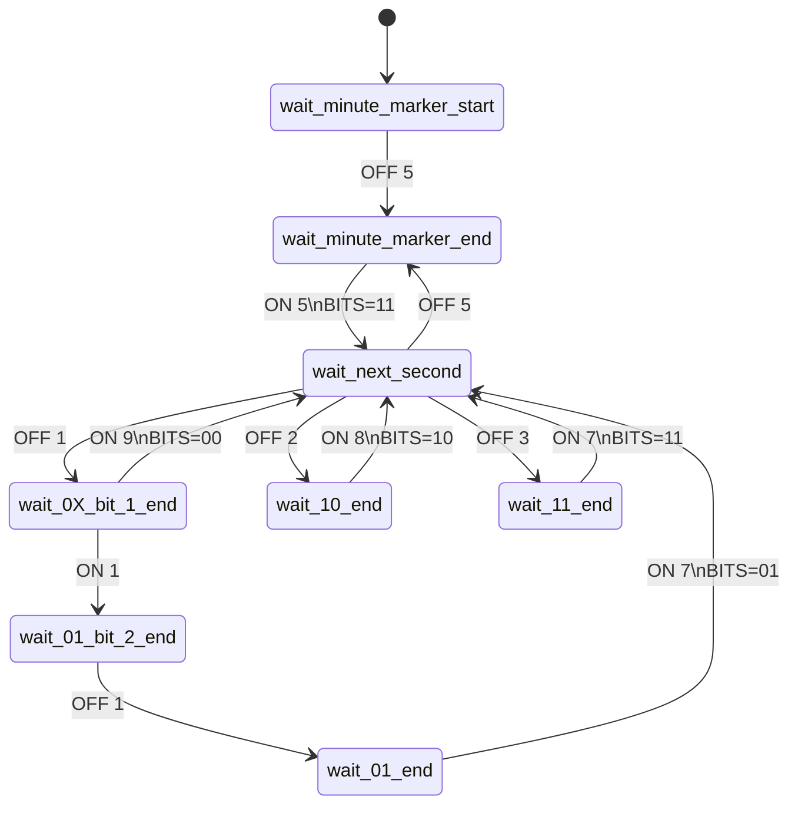
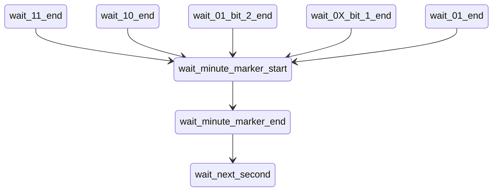

# msf-atomic-clock-decoder

Decode MSF atomic clock transmissions using ESP8266 and interrupts.

This is a WIP propject, with lots of refactoring, exploration and trying things out.

The end aim is for a library to support decoding of MSF-60 (UK) atomic clock transmissions on an ESP8266, and ESP32.

The library will use interrupts, so the ESP/Arduino can carry on doing other things, such as handling the clock display.

The main components are:

    carrier on/off timer -> state machine bit extractor -> date and time constructor -> clock display

## State Diagrams

The MSF transmitter switches the carrier on and off one or more times a second.
It splits time into 100mS intervals and changes the state of the carrier only
on one of those intervals.

A 100mS division of a second will be referred to as a "div" in this library.
Each second is divided into ten 100mS or deciseconds, or "divs".
Each are labeled 1 to 10 in the state machine that drives the library.

### Success Path Transistions

Each transition is marked with the carrier state (`ON` or `OFF`) and the
number of divs is has stayed in that state (each div is 100mS).

The success path from `wait_next_second` back to itself will contain
exactly ten divs, adding up to one second. Each transition will be a
state change of the carrier from `ON` to `OFF`, or from `OFF` to `ON`.

### Error Transition Recovery

If a carrier state for an unexpected number of divs occurs, then the
minute lock is considered lost.
The state returns to waiting for the miniute marker start (5 divs of
carrier `OFF`) to get a lock on a new minute.
Later there may be patterns that can be used to lock back on to the
miniute earlier, or places where a small timing error can be ignored
because they don't affect the bit stream being read.

## (Binary Coded Decimal) BCD Decoding

The BCD encoded digits in the bit stream are listed in the table below.

| Digit Number | Value Name | Bit A From | Bit A To | Magnitude |
| ------------ | ---------- | ---------- | -------- | --------- |
| 0            | Year       | 17         | 20       | Tens 0-9  |
| 1            | Year       | 21         | 24       | Units 0-9 |
| 2            | Month      | 25         | 25       | Tens 0-1  |
| 3            | Month      | 26         | 29       | Units 0-9 |
| 4            | Month Day  | 30         | 31       | Tens 0-3  |
| 5            | Month Day  | 32         | 35       | Units 0-9 |
| 6            | Week Day   | 36         | 38       | Units 0-6 |
| 7            | Hour       | 39         | 40       | Tens 0-2  |
| 8            | Hour       | 41         | 44       | Units 0-9 |
| 9            | Minute     | 45         | 47       | Tens 0-5  |
| 10           | Minute     | 48         | 51       | Units 0-9 |

So bits 17 to 15 will give is a stream of 11 decimal digits that can be
constructed into the year, month, day of month, day of week, hour and minute.
Each series of bits representing one digit, are binary encoded MSB first, and
the length of the sequence will depend on the magnitude of the sequence.

The digits are organised into this table as a step to developing a
data-driven BCD decoder.

# When Does The Time Apply?

This is a simple question, which does not seem to be well defined in the
specification at all. Here is what we do know.

The definition of a minute, is broadcast over the previous minute.
So the date and time, to the minute, is captured over the course of a minute,
that that date an time applies immediately the next minute starts.

Now, when does a minute start? Is it the end of the minute marker, or
the beginning of the minute marker?

Logic would suggest the minute starts at the *end* of the minute marker.
Each second broadcasts data and state. You cannot predict what that second
is going to broadcast until it has been broadcast, so it makes sense that
the end of the second, when it has finished broadcasting, is the point
at which the state that second represents now applies.

However, it seems that is not the case, based on other people's research.
My own observations confirm also that the minute starts at the *beginning*
of the minute marker, the moment the carrier drops for its 500mS silence.
Of course, you don't know it has dropped for 500mS under *after* it has
done so, so how can you tell the minute marker has started, marking the
start of the next minute?

This is solved using an alternate minute marker. For seconds 52 to 59,
bit A will broadcast `01111110`. The end of that last `0` will be a
dropped carier for the start of the 500mS minute marker, and *that*
is the point the next minute starts. That is when the seconds count
resets back to zero.
Since this state machine looks at state changes at the end of seconds
rather than at the start of seconds, then the new minute starts at the
end of the last bit A `0`.

