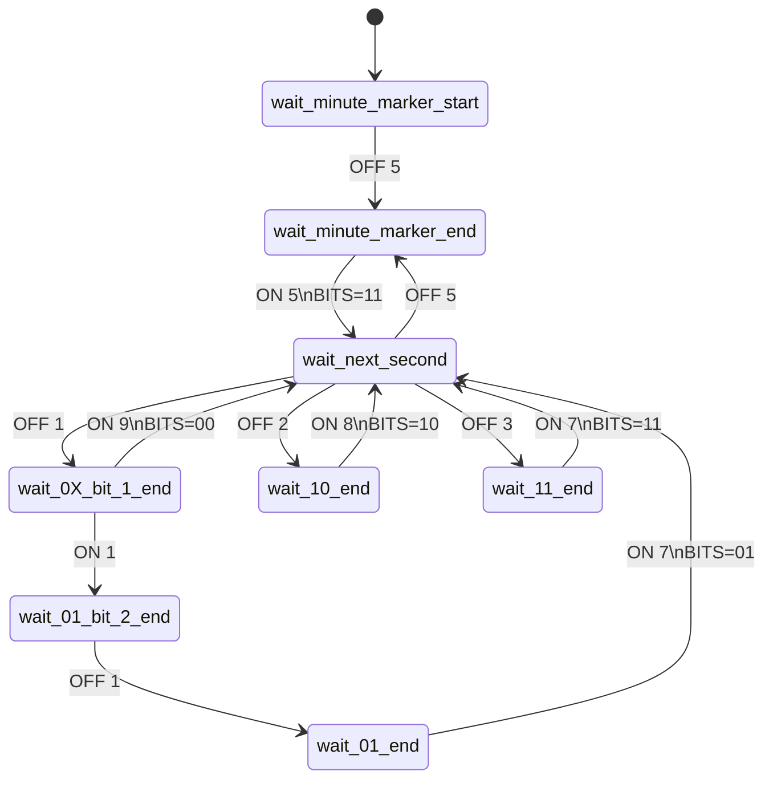
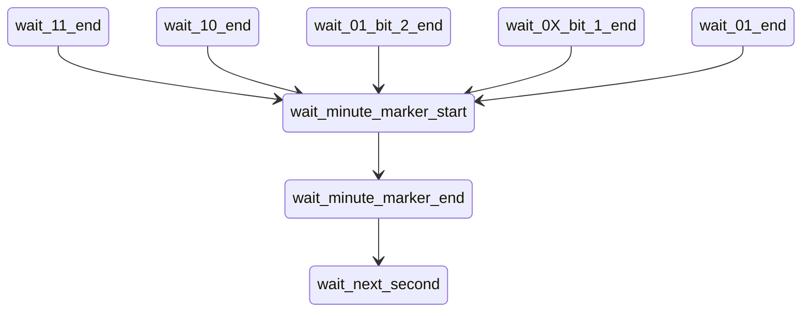

# msf-atomic-clock-decoder

Decode MSF atomic clock transmissions using ESP8266 and interrupts.

This is a WIP propject, with lots of refactoring, exploration and trying things out.

The end aim is for a library to support decoding of MSF-60 (UK) atomic clock transmissions on an ESP8266, and ESP32.

The library will use interrupts, so the ESP/Arduino can carry on doing other things, such as handling the clock display.

The main components are:

    carrier on/off timer -> state machine bit extractor -> date and time constructor -> clock display

## State Diagrams

The MSF transmitter switches the carrier on and off one or more times a second.
It splits time into 100mS intervals and changes the state of the carrier only
on one of those intervals.

A 100mS division of a second will be referred to as a "div" in this library.
Each second is divided into ten 100mS or deciseconds, or "divs".
Each are labeled 1 to 10 in the state machine that drives the library.

### Success Path Transistions

Each transition is marked with the carrier state (`ON` or `OFF`) and the
number of divs is has stayed in that state (each div is 100mS).

The success path from `wait_next_second` back to itself will contain
exactly ten divs, adding up to one second. Each transition will be a
state change of the carrier from `ON` to `OFF`, or from `OFF` to `ON`.

### Error Transistion Recovery

If a carrier state for an unexpected number of divs occurs, then the
minute lock is considered lost.
The state returns to waiting for the miniute marker start (5 divs of
carrier `OFF`) to get a lock on a new minute.
Later there may be patterns that can be used to lock back on to the
miniute earlier, or places where a small timing error can be ignored
because they don't affect the bit stream being read.

